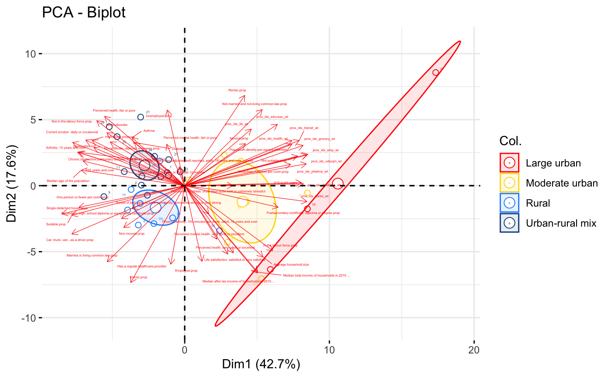
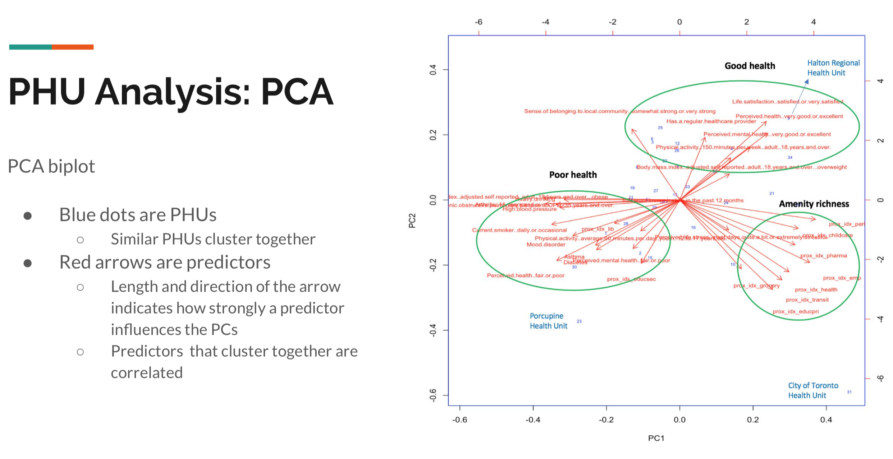
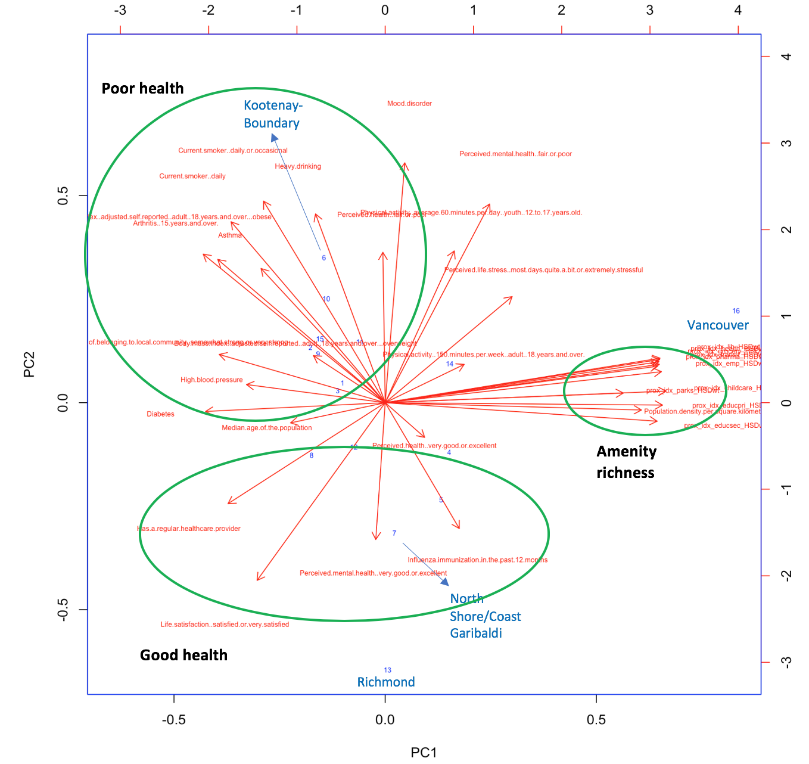

```{r, include=FALSE}
# Import the necessary libraries
library(skimr)
library(ellipse)
library(factoextra)
```

```{r, echo=FALSE, eval=FALSE}
# Import the PHU data
# df = read.csv(file = 'PHU_comorbid_prox_covid_FINAL_ngan.csv', stringsAsFactors = FALSE, na.strings="", header=TRUE)
# df = read.csv(file = 'PHU_master_prop.csv', stringsAsFactors = FALSE, na.strings="", header=TRUE)
```

## Import data
```{r }
# Import the PHU data
df_source = read.csv(file = 'PHU_merged_data.csv', stringsAsFactors = FALSE, na.strings="", header=TRUE)
colnames(df_source)

# skim(df)
# rownames(df)
# head(df)

```

## Clean data
Four variables with missing values: 

1. prox_idx_transit_med (Median proximity measure to transit) - **impute 0**

2. Breast.milk.feeding.initiation - **remove**

3. Exclusive.breastfeeding..at.least.6.months - **remove**

4. Body.mass.index..self.reported..youth..12.to.17.years.old...overweight.or.obese - **remove**

We remove the columns that are not needed and we will use weighted proximity scores rather than the median proximity scores. This leaves us with 55 predictor variables and 2 response variables. 

The predictor variables include:

1. Census variables (e.g. age, housing, income, education, employment) - 26

2. Proximity variables (e.g. transit, parks, grocery) - 10

3. Health variables (e.g. asthma, perceived health, obesity) - 19

The response variables are proportion (as a fraction of the population in the health region) of cases and fatalities. 

```{r, echo=FALSE}
df <- df_source
df <- df[c(5, 19, 32, 6, 10, 3, 15, 4, 29, 31, 25, 1, 2, 26, 9, 11, 12, 13, 16, 17, 21, 20, 24, 27, 28, 7, 8, 33, 14, 18, 22, 23, 34, 30), ]

# Transit prox median - impute 0
# df$prox_idx_transit_med[is.na(df$prox_idx_transit_med)] <- 0

# Breastfeeding variables and obesity in youth - remove
# Remove other variables not needed
# df <- df[,-c(1:2, 4:5, 32:42, 57:58, 60, 63, 78:99)] # Remove weighted prox scores
df <- df[,-c(1:2, 4:5, 32, 43:52, 56:58, 60, 63, 76, 78:99)] # Remove median prox scores

# rownames(df) <- df[,1]

# Convert percent data to proportions: 1. age group data 2. health data
# df[, c(16:34)] <- df[, c(16:34)]/100

colnames(df)
# head(df)

```

```{r, include=FALSE}
# # Clean data
# # We see that 4 variables have missing values
# # Transit prox - impute 0
# df$prox_idx_transit[is.na(df$prox_idx_transit)] <- 0
# 
# # Breastfeeding variables and obesity in youth - remove
# # Remove other variables not needed
# df <- df[,-c(1:2, 4, 7:15, 31, 32, 34, 37)]
# 
# 
# # Convert percent health data to proportions
# df[, c(15:35)] <- df[, c(15:35)]/100
# 
# # Reorder columns
# 
# df <- df[,c(1:3, 14, 
#   4:9, 12:13, 10:11, # prox
#   15, 17, 19:21, 23:24, 27:28, 31, # poor health
#   16, 30, 18, 25:26, 22, 29, 32:35)] # good health
# 
# colnames(df)

```

```{r, include=FALSE}
# Subset the data for analysis 
# listcolnames <- colnames(df)

# # For the orginal dataset with 36 PHUs
# keep_general <- c("Location_x", "HRUID", "HRPOP", "amenity_dense")
# keep_comorbids <- c(listcolnames[c(6:9, 12:15, 17:30)])
# keep_prox_med <- c(listcolnames[33:42])
# keep_prox_wt <- c(listcolnames[43:52])
# keep_covid <- c(listcolnames[53:64])
# keep_comorbids_na <- c(listcolnames[c(10, 11, 16)])

# # Dataset with weighted proximity values
# keep_wt <- c(keep_general,keep_comorbids, keep_prox_wt, keep_covid)
# df_wt <- df[keep_wt]

```


```{r, include=FALSE }
# # Clean data

# # Remove commas and convert comorbids data to numeric
# comorbids = c('copd', 'asthma', 'hbp', 'smokers')
# df2[, comorbids] <- lapply(df2[, comorbids], function(x) as.numeric(gsub("[\\%,]", "", x)))

# # Convert the percent data to proportions
# df_med[, keep_comorbids] <- lapply(df_med[, keep_comorbids], function(x) as.numeric(gsub("[\\%,]", "", x))/100)
# df_wt[, keep_comorbids] <- lapply(df_wt[, keep_comorbids], function(x) as.numeric(gsub("[\\%,]", "", x))/100)

```

## PCA on the data
```{r }
pca <- prcomp(df[,-c(1, 57:58)], scale = TRUE)
s <- summary(pca)

```

```{r }
# Scree plot
plot(pca, type="lines")

```


## Principal components regression (PCR) against proportion of cases
```{r }
# pca$x <- -pca$x
# pca$rotation <- -pca$rotation

# Extract the first 6 principal components (based on the Scree plot) for PCR
pcs <- pca$x[,c("PC1", "PC2", "PC3", "PC4", "PC5", "PC6")]

# Create a dataframe with reponse variable TOTAL proportion of COVID cases and explanatory variables (the PCs)
pcr_data <- as.data.frame(cbind(df[,"TOTAL_prop"], pcs))
# head(pcr_data)

# Perform linear regression
phu_lm_total <- lm(V1~., data = pcr_data)
summary(phu_lm_total)

```


```{r, }
## Review PCs 1 and 3
pca$rotation[,c(1)]
# a <- pca$rotation[,1:3]
# write.csv(a, file = "pca_pcs123.csv")

```

## Review the top loading scores
```{r, }
loading_scores <- pca$rotation[,1]
var_scores <- abs(loading_scores)

# Rank and show the top 10 loading score by magnitude
var_scores_ranked <- sort(var_scores, decreasing = TRUE)
top_10_var <- names(var_scores_ranked[1:10])
top_10_var

pca$rotation[top_10_var, 1] 
nrow(pca$rotation)

```

# Graph the PCA
```{r, echo=FALSE}
# Create groups
pch.group <- c(rep(21, times=3), rep(21, times=7), rep(21, times=15), rep(21, times=9))
col.group <- c(rep("red", times=3), rep("gold", times=7), rep("dodgerblue", times=15), rep("dodgerblue4", times=9))

# PCA graph using the base graphics function plot()
plot(pca$x[,1], pca$x[,2], xlab=paste("PCA 1 (", round(s$importance[2]*100, 1), "%)", sep = ""), ylab=paste("PCA 2 (", round(s$importance[5]*100, 1), "%)", sep = ""), pch=pch.group, col="black", bg=col.group, cex=1.5, las=1, asp=1)

# Add grid lines
abline(v=0, lty=2, col="grey50")
abline(h=0, lty=2, col="grey50")

# Get co-ordinates of variables (loadings), and multiply by 10

l.x1 <- pca$rotation[27:55,1]*25
# pca$rotation[37:55,1]
l.x2 <- pca$rotation[1:26,1]*25

l.y1 <- pca$rotation[27:55,2]*25
# pca$rotation[37:55,1]
l.y2 <- pca$rotation[1:26,2]*25

# l.x <- pca$rotation[,1]*25
# l.y <- pca$rotation[,2]*25

# Draw arrows
arrows(x0=0, x1=l.x1, y0=0, y1=l.y1, col="tomato", length=0.10, lwd=1.0)
arrows(x0=0, x1=l.x2, y0=0, y1=l.y2, col="darkblue", length=0.10, lwd=1.0)

# # Label position
# l.pos <- l.y # Create a vector of y axis coordinates
# lo <- which(l.y < 0) # Get the variables on the bottom half of the plot
# hi <- which(l.y > 0) # Get variables on the top half
# # Replace values in the vector
# l.pos <- replace(l.pos, lo, "1")
# l.pos <- replace(l.pos, hi, "3")

# Variable labels
# text(l.x1, l.y1, labels=row.names(pca$rotation), col="tomato", pos=l.pos, cex = 0.5)
# text(l.x2, l.y2, labels=row.names(pca$rotation), col="darkorange", pos=l.pos, cex = 0.5)


# # Add legend
# legend("bottomright", legend=c("Large urban", "Moderate urban", "Urban-rural mix", "Rural"), col="black", pt.bg=c("red", "gold", "dodgerblue", "dodgerblue4"), pch=c(21, 21, 21, 21), pt.cex=1.5)
# 
# # Get individuals (observations) as a matrix
# tab <- matrix(c(pca$x[,1], pca$x[,2]), ncol=2)
# # Calculate correlations
# c1 <- cor(tab[1:3,])
# c2 <- cor(tab[4:10,])
# c3 <- cor(tab[11:25,])
# c4 <- cor(tab[26:34,])
# 
# # Plot ellipse
# polygon(ellipse(c1*(max(abs(pca$rotation))*1), centre=colMeans(tab[1:3,]), level=0.95), col=adjustcolor("red", alpha.f=0.25), border="red")
# polygon(ellipse(c2*(max(abs(pca$rotation))*1), centre=colMeans(tab[4:10,]), level=0.95), col=adjustcolor("gold", alpha.f=0.25), border="gold")
# polygon(ellipse(c3*(max(abs(pca$rotation))*1), centre=colMeans(tab[11:25,]), level=0.95), col=adjustcolor("dodgerblue", alpha.f=0.25), border="dodgerblue")
# polygon(ellipse(c4*(max(abs(pca$rotation))*1), centre=colMeans(tab[26:34,]), level=0.95), col=adjustcolor("dodgerblue4", alpha.f=0.25), border="dodgerblue4")

# # Biplot
# biplot(pca, col = c("blue", "red"), cex = c(0.5,0.5))


```



```{r, include=FALSE}
# Create groups
group <- c(rep("Large urban", times=3), rep("Moderate urban", times=7), rep("Urban-rural mix", times=15), rep("Rural", times=9))

# Plot
fviz_pca_biplot(pca, repel=TRUE, pointsize=2, pointshape=21, col.var="red", arrowsize=0.2, labelsize=1, col.ind=group, palette=c("red", "gold", "dodgerblue", "dodgerblue4"), addEllipses=TRUE, ellipse.type="confidence")

# # Biplot
# biplot(pca, col = c("blue", "red"), cex = c(0.5,0.5))


```

### Without the census data



```{r, include=FALSE }
# # Barplot scree plot

# # Calculate how much of the variation each PC accounts for
# pca.var <- pca$sdev^2

# # Calculate the percentage of the variation that each PC accounts for
# pca.var.per <- round(pca.var/sum(pca.var)*100, 1)

# barplot(pca.var.per, main = "Scree Plot", xlab = "Principal Component", ylab = "Percent Variation")

```


## Principal components regression (PCR) against proportion of fatalities
```{r }
# Create a dataframe with reponse variable FATALprop and explanatory variables (the PCs)
pcr_data2 <- as.data.frame(cbind(df[,"FATAL_prop"], pcs))
head(pcr_data2)

# Perform linear regression
phu_lm_fatal <- lm(V1~., data = pcr_data2)
summary(phu_lm_fatal)

```


```{r, include=FALSE}
## Review PCs 1 and 6
pca$rotation[,c(1,6)]

```


```{r, include=FALSE }
# library(ggplot2)
# library(grid)
# library(RColorBrewer)
# # colnames(df_source)
# density <- df_source[, 6]
# PCbiplot <- function(PC, x="PC1", y="PC2") {
#     # PC being a prcomp object
#     data <- data.frame(obsnames=row.names(PC$x), PC$x)
#     plot <- ggplot(data, aes_string(x=x, y=y)) + geom_point(aes(colour = density), alpha=1, size=2) + scale_color_gradient(low = "blue", high = "orange red")
#     plot <- last_plot() + theme_minimal()
#     # plot <- ggplot(data, aes_string(x=x, y=y)) + geom_text(alpha=.6, size=2.5, aes(label=obsnames))
#     # plot <- plot + geom_hline(aes(0), size=.2) + geom_vline(aes(0), size=.2)
#     datapc <- data.frame(varnames=rownames(PC$rotation), PC$rotation)
#     mult <- min(
#         (max(data[,y]) - min(data[,y])/(max(datapc[,y])-min(datapc[,y]))),
#         (max(data[,x]) - min(data[,x])/(max(datapc[,x])-min(datapc[,x])))
#         )
#     datapc <- transform(datapc,
#             v1 = .7 * mult * (get(x)),
#             v2 = .7 * mult * (get(y))
#             )
#     plot <- plot + coord_equal() + geom_text(data=datapc, aes(x=v1, y=v2, label=varnames), size = 3.5, vjust=1, color="red")
#     plot <- plot + geom_segment(data=datapc, aes(x=0, y=0, xend=v1, yend=v2), arrow=arrow(length=unit(0.2,"cm")), alpha=0.75, color="red")
#     plot
# }
# 
# PCbiplot(pca)

```


```{r, include=FALSE }
# # Use ggplot2 to plot the data
# library(ggplot2)
# pca.data <- data.frame(Sample = df$ENG_LABEL, X=pca$x[,1], Y=pca$x[,2])
# pca.data
# 
# ggplot(data=pca.data, aes(x=X, y=Y, label = Sample)) +
#   geom_text() + geom_point() +
#   xlab(paste("PC1 - ", pca.var.per[1], "%", sep = "")) +
#   ylab(paste("PC2 - ", pca.var.per[2], "%", sep = "")) +
#   theme_bw() +
#   ggtitle("PCA Graph")

```


```{r, include=FALSE }
## Factor Analysis
# Extract the predictor columns
# df2_prop2 <- df2_prop[,-c(1,2,3)]
# df_med2 <- df_med[,-c(1:4, 37:48)]


# Check KMO, Bartletts which tells us if FA is appropriate
# KMO values between 0.8 and 1 indicate the sampling is adequate.
# KMO values less than 0.6 indicate the sampling is not adequate and that remedial action should be taken. Some authors put this value at 0.5, so use your own judgment for values between 0.5 and 0.6.
# KMO Values close to zero means that there are large partial correlations compared to the sum of correlations. In other words, there are widespread correlations which are a large problem for factor analysis.
library(psych)

# KMO(cor(df2_prop2))
colnames(df)
KMO(cor(df[,-c(1, 59:60)]))
# We look for MSA > 0.5
# The following variables have MSA < 0.5
# Asthma
# Body.mass.index..adjusted.self.reported..adult..18.years.and.over...overweight
# Diabetes
# Has.a.regular.healthcare.provider
# Influenza.immunization.in.the.past.12.months
# Life.satisfaction..satisfied.or.very.satisfied
# Perceived.life.stress..most.days.quite.a.bit.or.extremely.stressful
# Perceived.mental.health..fair.or.poor 
# Perceived.mental.health..very.good.or.excellent 
# Physical.activity..150.minutes.per.week..adult..18.years.and.over. 
# Physical.activity..average.60.minutes.per.day..youth..12.to.17.years.old. 
# Sense.of.belonging.to.local.community..somewhat.strong.or.very.strong
# prox_idx_grocery_med 
# prox_idx_educsec_med 
# prox_idx_lib_med 

# print(cortest.bartlett(cor(df_med2), nrow(df_med2)))
print(cortest.bartlett(cor(df[,-c(1, 59:60)]), nrow(df[,-c(1, 59:60)])))
# Bartletts test of sphericity is significant

```

```{r, eval=FALSE, include=FALSE }
phu_fa <- factanal(df[,-c(1, 59:60)], factors = 6, rotation = "varimax", scores = "regression")
# phu_fa <- factanal(df2_prop2, factors = 2, rotation = "varimax", scores = "regression")
# phu_fa <- factanal(df2_prop2, factors = 2, rotation = 'none')
# phu_fa <- factanal(df2_prop2, factors = 2, rotation = 'promax', scores = c("regression"))
phu_fa

```

```{r, eval=FALSE, include=FALSE}
# Use factor scores as explanatory variables in a regression analysis
phu_fa$scores

total_fa <- as.data.frame(cbind(df[,"TOTALprop"], phu_fa$scores))
# total_fa <- as.data.frame(cbind(df2_prop[,"TOTALprop"], phu_fa$scores))
head(total_fa)

mod = lm (V1~., total_fa)
summary(mod)

```

```{r, include=FALSE }
# # 3d plot
# options(rgl.useNULL = TRUE)
# library(rgl)
# with(total_fa, plot3d(V1, Factor1, Factor2, type="p"))
# triangles3d(total_fa[,1], total_fa[,2], total_fa[,3])
# rglwidget()
# 
# fit <- lm(V1~., total_fa)
# surfacefn <- function(x, y) cbind(1, x, y, z) %*% coef(fit)
# persp3d(surfacefn, add = TRUE, col = "blue")
```


```{r, eval=FALSE, include=FALSE }
# fatal_fa <- as.data.frame(cbind(df2_prop[,"FATALprop"], phu_fa$scores))
fatal_fa <- as.data.frame(cbind(df_med[,"FATAL_prop"], phu_fa$scores))
head(fatal_fa)

mod = lm (V1~., fatal_fa)
summary(mod)

```


```{r, eval=FALSE, include=FALSE }
set.seed(100)
indices= sample(1:nrow(total_fa), 0.7*nrow(total_fa))
train = total_fa[indices,]
test = total_fa[-indices,]

mod = lm (V1~., train)
summary(mod)

library(car)
vif(mod)

# Model Performance metrics:
library(Metrics)

# Model 1:
pred_test1 <- predict(mod, newdata = test, type = "response")
pred_test1

```

### BC biplot

```{r }

```


```{r }

```


```{r }

```


```{r }

```


```{r }

```


```{r }

```


