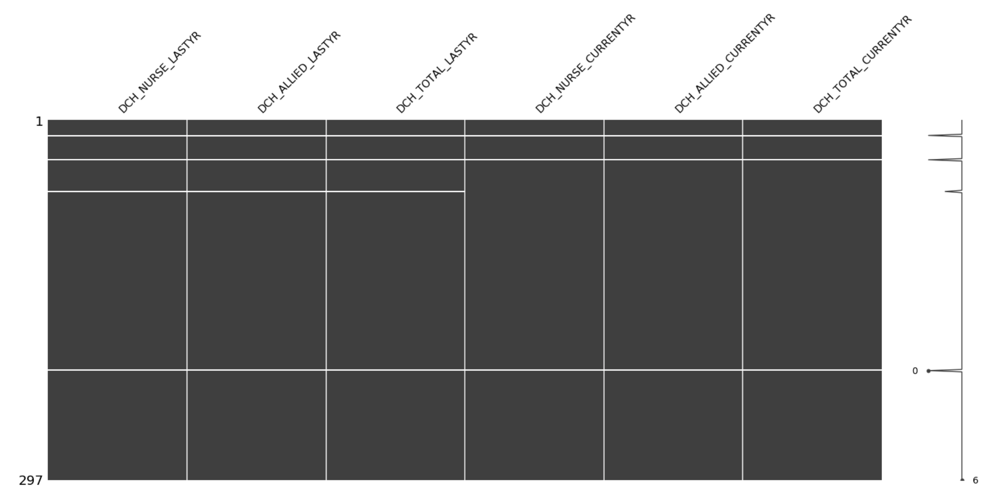
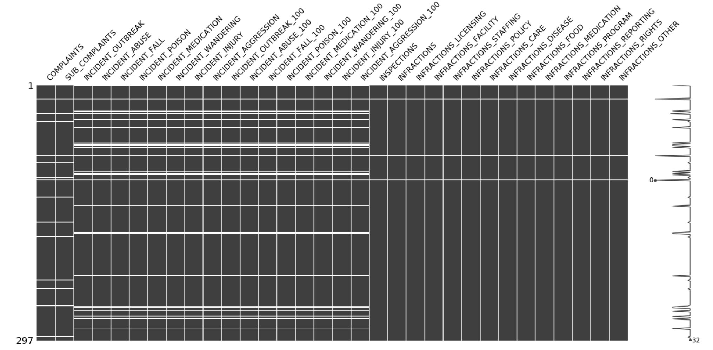
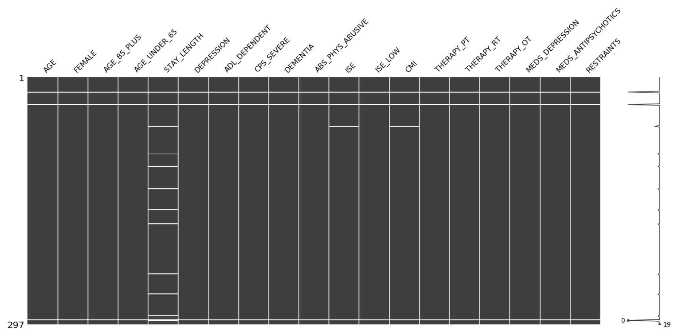
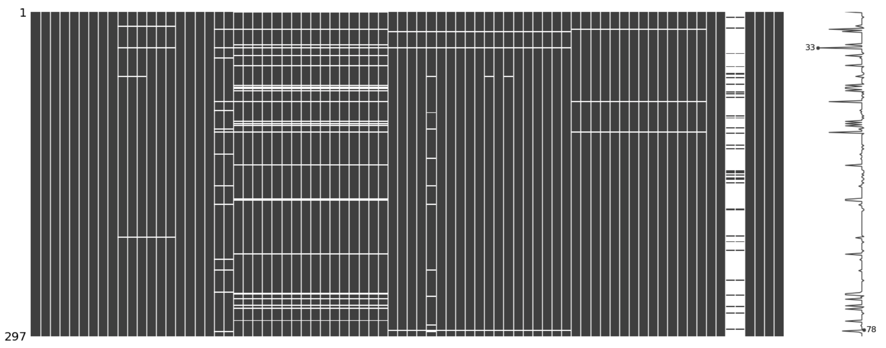

## General Home Information

Parameter | Type | Description | NA
----------|------|------------|----
`FACILITY_NAME` | string | Name of long-term care facility. | 0
`HCC_CODE` | string | Unique identifier of facility. | 0
`HLTH_AUTH` | string | Name of health authority that home resides in. | 0
`OWNERSHIP` | string | Funding - either HA (Health Authority), PFP (for-profit), PNP (non-profit). | 0
`STREET_ADDRESS` | string | Street address. | 0
`CITY` | string | City. | 0
`POSTAL` | string | Postal code.| 0
`REGULATION` | string | Licensing either under the Community Care and Assisted Living Act, or licensed or designated under the Hospital Act $^{(1)}$. | 0
`ACCRED_STATUS` | string | Accreditation is a voluntary process that LTC homes may use to assess their services and help them improve the quality, safety and efficiency of their performance for the benefit of their residents and the health system $^{(2)}$.| 0
$^*$`DCH_NURSE_LASTYR` | float | Nursing/care aide care hours (last year). | 4
$^*$`DCH_ALLIED_LASTYR` | float | Allied health hours (last year). "Allied health care workers, such as physical, occupational or recreational therapists, speech language pathologists, social workers and dietitians." $^{(5)}$ | 4
$^*$`DCH_TOTAL_LASTYR` | float | Total direct care hours (last year). | 4
$^*$`DCH_NURSE_CURRENTYR` | float | Nursing/care aide care hours (current year). | 3
$^*$`DCH_ALLIED_CURRENTYR` | float | Allied health hours (current year). | 3
$^*$`DCH_TOTAL_CURRENTYR` | float | Total direct care hours (current year). | 3
`latitude` | float | Latitude positioning of home according to Statistics Canada's ODHF. | 0
`longitude` | float | Longitude positioning of home according to Statistics Canada's ODHF. | 0

$^*$**DCH:** Direct care hours - may be delivered by nursing staff, care aides, or allied health care workers, such as physical, occupational or recreational therapists, speech language pathologists, social workers and dietitians. $^{(5)}$

## Detailed Home Information

Parameter | Type | Description | NA
----------|------|------------|---
`BEDS_TOTAL` | int64 | Total number of beds in facility.  | 0
`ROOMS_PRIVATE` | int64 | Number of private rooms. | 0
`ROOMS_SEMI` | int64 | Number of semi-private rooms (2 beds). | 0
`ROOMS_MULTI` | int64 | Number of mult-persons rooms (3+ beds). | 0
`BEDS_PRIVATEprop` | int64 | Proportion of private beds in facility. | 0
`RESIDENT_COUNCIL` | binary boolean | "TRUE" or "FALSE".$^*$ | 0
`FAMILY_COUNCIL` | binary boolean | "TRUE" or "FALSE".$^*$ | 0

$^*$A family and/or resident  council is also self-led, self-determining and democratic. Councils exist to engage the resident community in collaborative activities which will advance the quality of life for residents. $^{(2)}$

## Quality Metrics$^4$

Parameter | Type | Description | NA
----------|------|------------|-------
`COMPLAINTS` | int64 | Number of licensing complaints. | 14
`COMPLAINTS_SUB` | int64 | Number of substantiated licensing complaints. | 14
`INCIDENT_OUTBREAK` | int64 | Total disease or outbreak occurences.  | 25
`INCIDENT_ABUSE` | int64 | Total documented cases of abuse or neglect.  | 25
`INCIDENT_FALL` | int64 | Total documented cases of falls with injury / adverse events.  | 25
`INCIDENT_POISON` | int64 | Total documented cases of food or other poisonings.  | 25
`INCIDENT_MEDICATION` | int64 | Total documented cases of medication error with adverse event.  | 25
`INCIDENT_WANDERING` | int64 | Total documented cases of missing or wandering person.  | 25
`INCIDENT_INJURY` | int64 | Total documented cases of other injury.  | 25
`INCIDENT_AGGRESSION` | int64 | Total documented cases of aggression between persons in care.  | 25
`INCIDENT_OUTBREAK_100` | int64 | Per 100 beds, disease or outbreak occurences.  | 25
`INCIDENT_ABUSE_100` | int64 | Per 100 beds, documented cases of abuse or neglect.  | 25
`INCIDENT_FALL_100` | int64 | Per 100 beds, documented cases of falls with injury / adverse events.  | 25
`INCIDENT_POISON_100` | int64 | Per 100 beds, documented cases of food or other poisonings.  | 25
`INCIDENT_MEDICATION_100` | int64 | Per 100 beds, documented cases of medication error with adverse event.  | 25
`INCIDENT_WANDERING_100` | int64 | Per 100 beds, documented cases of missing or wandering person.  | 25
`INCIDENT_INJURY_100` | int64 | Per 100 beds, documented cases of other injury.  | 25
`INCIDENT_AGGRESSION_100` | int64 | Per 100 beds, documented cases of aggression between persons in care.  | 25
`INSPECTIONS` | float64 | Number of inspections.  | 3
`INFRACTIONS` | float64 | Number of licensing infractions found.  | 3
`INFRACTIONS_LICENSING` | float64 | Licensing infractions - Licensing.  | 3
`INFRACTIONS_FACILITY` | float64 | Licensing infractions - physcial facility, equipment & furnishings.  | 3
`INFRACTIONS_STAFFING` | float64 | Licensing infractions - staffing.  | 3
`INFRACTIONS_POLICY` | float64 | Licensing infractions - policies & procedures.  | 3
`INFRACTIONS_CARE` |float64 | Licensing infractions - care & supervision.  | 3
`INFRACTIONS_DISEASE` | float64 | Licensing infractions - hygiene & communicable disease control.  | 3
`INFRACTIONS_FOOD` | float64 | Licensing infractions - nutrition & food services.  | 3
`INFRACTIONS_MEDICATION` | float64 | Licensing infractions - medication.  | 3
`INFRACTIONS_PROGRAM` | float64 | Licensing infractions - program.  | 3
`INFRACTIONS_REPORTING` | float64 | Licensing infractions - records & reporting.  | 3
`INFRACTIONS_RIGHTS` | float64 | Licensing infractions - resident bill of rights.  | 3
`INFRACTIONS_OTHER` | float64 | Licensing infractions - other.  | 3

## General Resident Health Profile$^4$

Parameter | Type | Description | NA
----------|------|------------|---------
`AGE` | int64 | Average age of population.  | 3
`FEMALE` | int64 | Percent female.  | 3
`AGE_85_PLUS` | int64 | Percent 85 years or older.  | 3
`AGE_UNDER_65` | int64 | Percent younger than 65 years.  | 3
`STAY_LENGTH` | int64 | Average length of stay.  | 13
`DEPRESSION` | float64 | Percent of residents diagnosed with depression.  | 3
`ADL_DEPENDENT` |float64  | Percent of residents dependent in activities of daily living.  | 3
`CPS_SEVERE` | float64 | Percent of residents with severe cognitive impairment.  | 3
`DEMENTIA` |  float64 | Percent of residents with dementia.  | 3
`ABS_PHYS_ABUSIVE` | float64 | Percent of residents with physically abusive behaviour.  | 3
`ISE` | float64  | Average index of social engagement.  | 4
`ISE_LOW` | float64 | Percent of residents with low social engagement.  | 3
`CMI` | float64 | Case mix index. "A standardized method for calculating the intensity of resources required to meet the needs of a resident and reflects a measure of clinical complexity of the resident population as a whole. A higher score indicates that a greater intensity of resources is required to meet the needs of the resident population." $^{(5)}$  | 4
`THERAPY_PT` | float64 | Percents of residents receiving physical therapy.  | 3
`THERAPY_RT` | float64 | Percents of residents receiving recreation therapy.  | 3
`THERAPY_OT` | float64 | Percents of residents receiving occupational therapy.  | 3
`MEDS_DEPRESSION` | float64 | Percent of residents receiving depression medication.  | 3
`MEDS_ANTIPSYCHOTICS` | float64 | Percent of residents taking antipsychotics without a diagnosis of psychosis.  | 3
`RESTRAINTS` | float64 | Percent of residents with daily physical restraints.  | 3

## COVID-19 Related Parameters

Parameter | Type | Description
----------|------|------------
`Total Confirmed Cases` | int64 | Total number of COVID-19 cases according to Ministry of Health Representative (Stephen May).
`Total Deaths` | int64 | Total number of deaths according to Ministry of Health Representative (Stephen May).
`outbreaks` | binary numeric | 1 (outbreak has occured) or 0 (outbreak has not occured)

---

\pagebreak

# Data Quality

  * Data sparsity and NA's: 
    
      * Mostly apparent in `INCIDENT_*` and `INFRACTIONS_*` predictors.
    
      * Majority of NA's exist in Northern Health Authority.
    
  * High multicollinearity exists between `ISE_LOW` and `ISE` (choose one).
    

\pagebreak

#### References

$^1$ [https://www2.gov.bc.ca/gov/content/health/accessing-health-care/finding-assisted-living-or-residential-care/residential-care-facilities](https://www2.gov.bc.ca/gov/content/health/accessing-health-care/finding-assisted-living-or-residential-care/residential-care-facilities)

$^2$ [https://www2.gov.bc.ca/gov/content/health/accessing-health-care/home-community-care/accountability/family-and-resident-councils](https://www2.gov.bc.ca/gov/content/health/accessing-health-care/home-community-care/accountability/family-and-resident-councils)

$^3$ [http://health.gov.on.ca/en/public/programs/ltc/glossary.aspx](http://health.gov.on.ca/en/public/programs/ltc/glossary.aspx)

$^4$ Excel provided by Seniors Advocate Representative.

$^5$ 2019 BRITISH COLUMBIA Long-Term Care Facilities Quick Facts Directory.
